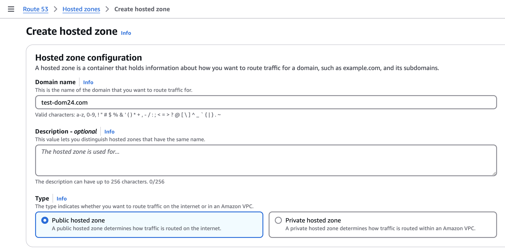
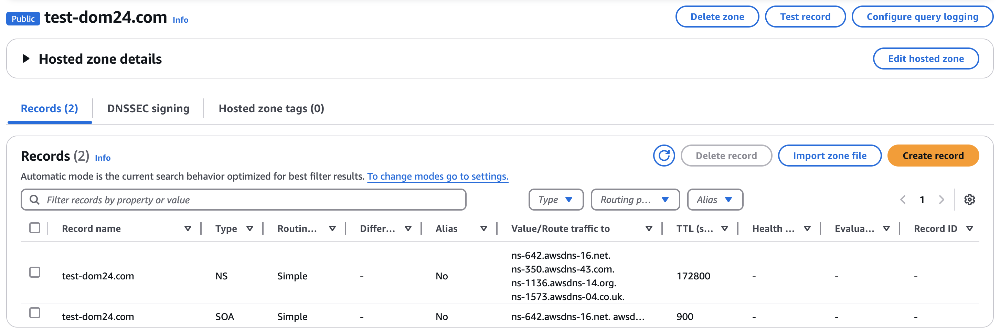

# Guide de délégation de domaine OVH vers AWS Route 53

## Contexte
Ce guide détaille la procédure de délégation d'un nom de domaine acheté chez OVH vers les serveurs DNS d'Amazon Route 53. Cette configuration vous permettra de gérer vos enregistrements DNS directement depuis AWS tout en conservant votre domaine chez OVH.

## Prérequis
- Un compte AWS actif avec accès à Route 53
- Un domaine enregistré chez OVH
- Accès à l'espace client OVH
- Accès à la console AWS

## Étapes de configuration

### 1. Création de la zone hébergée dans AWS Route 53

1. Connectez-vous à la [console AWS](https://console.aws.amazon.com)
2. Accédez au service Route 53
3. Dans le menu de gauche, cliquez sur "Zones hébergées"
4. Cliquez sur le bouton "Créer une zone hébergée"
5. Remplissez les champs suivants :
   - Nom de domaine : entrez votre nom de domaine (exemple.com)
   - Description : facultatif, mais recommandé pour la gestion
   - Type : laissez "Zone hébergée publique" sélectionné



6. Cliquez sur "Créer"
7. **Important** : Notez les 4 serveurs de noms (NS) fournis par AWS



### 2. Modification des serveurs DNS chez OVH

1. Connectez-vous à [l'espace client OVH](https://www.ovh.com/manager/)
2. Accédez à la section "Domaines"
3. Sélectionnez votre domaine dans la liste
4. Cliquez sur l'onglet "Serveurs DNS"
5. Cliquez sur "Modifier les serveurs DNS"
6. Remplacez les serveurs DNS actuels par les 4 serveurs de noms AWS notés précédemment
7. Validez les modifications

## Temps de propagation

La propagation des modifications DNS peut prendre jusqu'à 48 heures, bien que les changements soient généralement effectifs dans les 2-4 heures suivant la modification.

## Vérification

Pour vérifier que la délégation est effective, vous pouvez utiliser les commandes suivantes dans un terminal :

```bash
dig NS votredomaine.com
whois votredomaine.com
```

Les serveurs DNS retournés devraient correspondre à ceux d'AWS Route 53.

## Maintenance

Une fois la délégation effectuée, toutes les modifications DNS devront être faites dans AWS Route 53. Les modifications faites dans l'interface OVH n'auront plus d'effet sur votre domaine.
